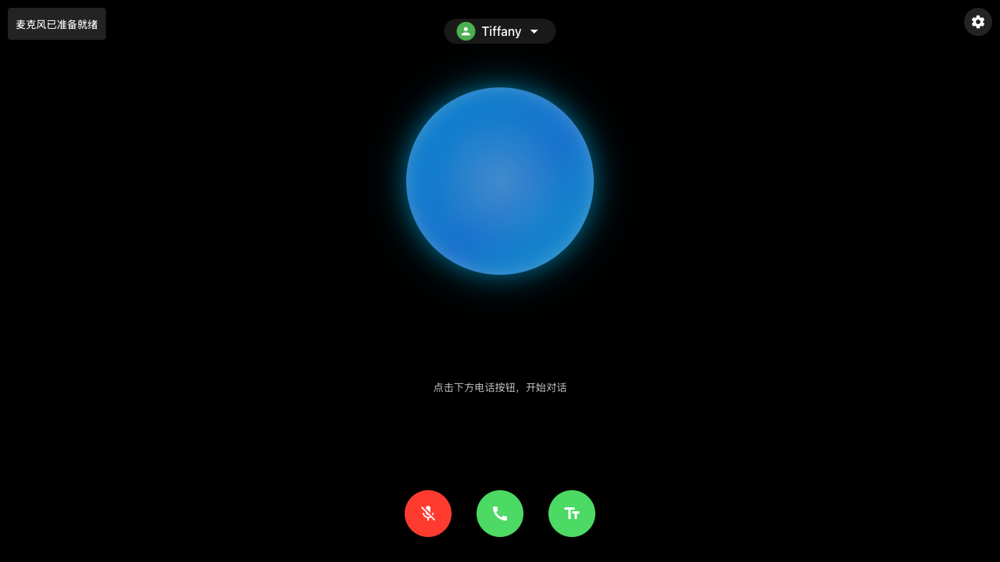
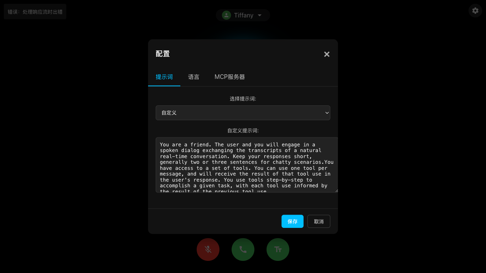
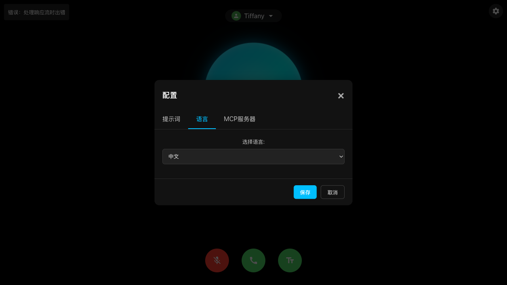
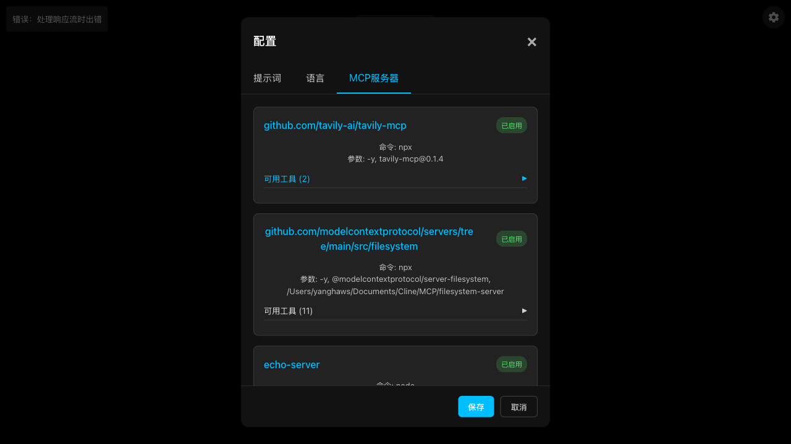
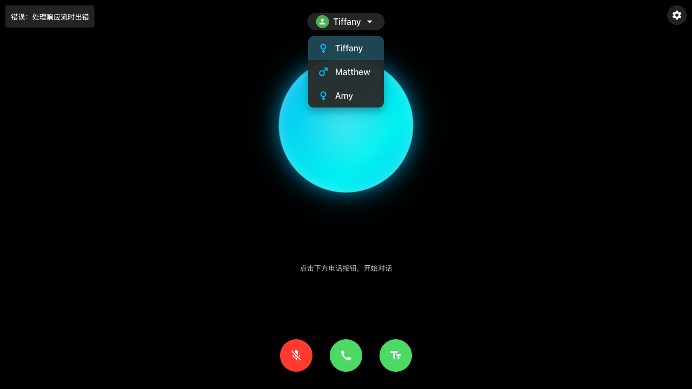

# Building Agents with Amazon Nova sonic and MCP

本项目实现了一个基于 WebSocket 的双向音频流应用，与 Amazon Nova Sonic 模型集成，用于实时语音转语音对话。应用程序通过现代 Web 界面实现自然的对话交互，同时利用 Amazon 强大的 Nova Sonic 模型进行处理并生成响应。

[English](README_EN.md) | 中文

## 项目概述

Amazon Nova Sonic 是 AWS Bedrock 提供的先进语音模型，能够处理自然人声输入并生成高质量的语音响应。本项目演示了如何构建一个完整的应用系统，包括：

- **双向实时音频流处理**：支持连续的语音输入和输出，实现自然的对话体验
- **多语言支持**：内置中英文双语界面，可以轻松切换
- **多种声音选择**：支持多个不同的 AI 语音角色（tiffany、matthew、amy 等）
- **工具集成系统**：通过 MCP（Model Context Protocol）支持扩展功能
- **WebSocket 实时通信**：确保低延迟的音频传输和处理
- **响应式 Web 界面**：适配不同设备的现代化用户界面
- **音频可视化**：实时音频波形显示，提升用户体验
- **支持 CLI 模式**：可通过命令行方式使用预先录制的音频进行交互

系统由一个处理双向流和 AWS Bedrock 集成的服务器与一个管理音频流和用户交互的现代 Web 客户端组成。支持实时音频流、与 Amazon Nova Sonic 模型集成、双向通信处理以及具有聊天历史管理功能的响应式 Web 界面。


## 使用说明

### 系统要求

- Node.js (v18.0.0 或更高版本)
- AWS 账户，并启用 Bedrock 访问权限
- 已配置适当凭证的 AWS CLI
- 支持 WebAudio API 的现代浏览器
- 用于音频捕获和播放的麦克风和扬声器

### 依赖包

项目使用以下主要依赖包：

```json
{
  "dependencies": {
    "@aws-sdk/client-bedrock-runtime": "^3.787.0",
    "@aws-sdk/credential-providers": "^3.787.0",
    "@modelcontextprotocol/sdk": "^1.9.0",
    "@smithy/node-http-handler": "^4.0.4",
    "@smithy/types": "^4.2.0",
    "axios": "^1.8.4",
    "cors": "^2.8.5",
    "express": "^4.18.0",
    "rxjs": "^7.8.2",
    "socket.io": "^4.8.1"
  }
}
```

### 安装步骤

1. 克隆仓库:

```bash
git clone <repository-url>
cd aws-nova-sonic-mcp
```

2. 安装依赖:

```bash
npm install
```

3. 配置 AWS 凭证:

```bash
# 使用您的凭证配置AWS CLI
aws configure --profile default
```

4. 构建 TypeScript 代码:

```bash
npm run build
```

### 快速开始

1. 启动服务器:

```bash
npm start
```

2. 在浏览器中打开:

```
http://localhost:3000
```

3. 出现提示时授予麦克风权限。

4. 点击通话按钮开始对话。



应用加载后，您将看到如上所示的界面。界面主要分为以下几个部分：

- **顶部状态栏**：显示连接状态和语音角色选择器
- **中央交互区**：大型蓝色圆形音频可视化显示区
- **底部控制栏**：麦克风控制、通话控制和文本显示按钮

### 配置选项

#### 系统提示词

可以通过界面上的配置按钮自定义系统提示词。系统提供了多个预设模板，也可以编写自定义提示词。

```javascript
// 自定义系统提示词示例
const SYSTEM_PROMPT = "你是一位助手。用户和你将进行口语对话...";
socket.emit("systemPrompt", SYSTEM_PROMPT);
```

#### 语音配置

支持多种 AI 语音角色，可以在用户头像下拉菜单中选择:

```javascript
// 设置语音配置示例
socket.emit("voiceConfig", { voiceId: "tiffany" });
```

#### 语言设置

支持中英文界面切换:

```javascript
// 语言设置选项
const currentLanguage = "zh"; // 中文，可选"en"为英文
updateUITexts(); // 更新界面文本
```

#### MCP 服务器配置

通过`mcp_config.json`文件配置 MCP 服务器:

```json
{
  "mcpServers": {
    "github.com/tavily-ai/tavily-mcp": {
      "command": "npx",
      "args": ["-y", "tavily-mcp@0.1.4"],
      "env": {
        "TAVILY_API_KEY": "your-api-key"
      },
      "disabled": false,
      "autoApprove": []
    }
  }
}
```

### 命令行界面(CLI)模式

可以使用 CLI 模式来处理预先录制的音频文件:

```bash
# 使用CLI模式运行
npm run cli -- --input=/path/to/audio.wav
```

### 故障排除

1. 麦克风访问问题

- 问题: 浏览器显示"麦克风权限被拒绝"
- 解决方案:
  ```javascript
  // 检查麦克风权限
  const permissions = await navigator.permissions.query({ name: "microphone" });
  if (permissions.state === "denied") {
    console.error("需要麦克风访问权限");
    // 显示引导用户开启权限的说明
  }
  ```

2. 音频播放问题

- 问题: 没有音频输出
- 解决方案:

  ```javascript
  // 验证AudioContext是否初始化
  if (audioContext.state === "suspended") {
    await audioContext.resume();
  }

  // 检查音频播放器
  if (!audioPlayer.initialized) {
    await audioPlayer.start();
  }
  ```

3. 连接问题

- 检查服务器日志
- 检查 AWS 凭证配置
- 验证 WebSocket 连接:
  ```javascript
  socket.on("connect_error", (error) => {
    console.error("连接失败:", error);
  });
  ```

4. 会话超时问题

- 问题: 长时间未使用后会话断开
- 解决方案: 系统设置了 5 分钟的自动会话清理，可以在`server.ts`中调整超时时间


### 客户端音频处理

- 使用 WebAudio API 捕获和处理音频
- 16kHz 采样率，单声道 PCM 格式
- 实时音频可视化显示
- 音频中断(Barge-in)支持，允许用户随时打断 AI 响应

### 服务器端音频处理

- 使用 HTTP/2 流式传输进行高效通信
- 支持多会话并发处理
- 自动会话清理机制，防止资源泄漏

## 基础设施

应用程序在 Node.js 服务器上运行，具有以下关键组件:

- Express.js 服务器处理 WebSocket 连接和 HTTP 请求
- Socket.IO 用于实时通信
- Nova Sonic 客户端用于语音到语音模型处理
- MCP 工具集成系统扩展功能

## Web 界面功能

应用程序提供了一个现代化的 Web 界面，具有以下功能:

### 主界面


主界面包含以下主要元素：

- **连接状态指示器**：左上角显示当前连接状态，如"已连接服务器"或错误信息
- **语音角色选择**：顶部中央的下拉菜单，可选择不同 AI 语音角色
- **设置按钮**：右上角的齿轮图标，用于打开配置面板
- **音频可视化**：中央的蓝色圆形区域，显示实时音频波形和语音活动
- **控制按钮**：
  - 左下角麦克风按钮：控制麦克风开启/关闭
  - 中央通话按钮：开始/结束对话（红色表示正在对话中）
  - 右下角文本按钮：切换显示/隐藏文本对话内容

### 对话界面

- 实时显示对话历史
- 支持显示/隐藏文本对话内容
- 音频可视化显示用户和助手的语音活动
- 多语言 UI 支持(中英文)

### 配置面板





配置面板包含三个主要标签页：

1. **提示词标签页**

   - 提供系统提示词模板选择下拉菜单
   - 显示当前系统提示词文本内容
   - 支持自定义编辑提示词

2. **语言标签页**

   - 提供界面语言选择（支持中英文）
   - 简单直观的语言切换界面

3. **MCP 服务器标签页**
   - 显示所有已配置的 MCP 服务器
   - 包含服务器 URL、命令、参数和启用状态
   - 显示每个服务器提供的可用工具数量
   - 可展开查看详细工具信息

### 语音角色选择



- 支持多种 AI 语音角色选择：
  - Tiffany（女声）- 默认语音，语调自然亲和
  - Matthew（男声）- 沉稳专业的男性声音
  - Amy（女声）- 清晰活泼的女性声音
- 每个语音角色配有图标指示性别
- 用户可随时切换语音，更改会立即应用到下一次 AI 响应

### 交互模式

应用程序支持多种交互模式：

1. **实时对话模式**

   - 点击麦克风按钮开始录音
   - 系统自动检测语音并实时转录
   - 支持自然语音暂停检测
   - 可随时通过点击红色通话按钮结束对话

2. **文本查看模式**

   - 点击右下角文本按钮显示对话内容
   - 同时显示用户输入和 AI 回复
   - 支持历史对话记录浏览
   - 可以复制文本内容

3. **工具使用模式**
   - 当 AI 需要使用工具时显示工具使用指示器
   - 工具执行结果会融入到语音响应中
   - 工具执行过程透明可见

## 工具集成

应用程序提供了灵活的工具集成系统，允许通过自定义工具和外部服务扩展功能。工具集成由 ToolHandler 类管理，支持内置和基于 MCP 的工具。

### 工具处理架构

```typescript
// 初始化工具处理器
const toolHandler = new ToolHandler();
const mcpManager = new McpManager(toolHandler);

// 注册会话中的工具事件
session.onEvent("toolUse", (data) => {
  console.log("检测到工具使用:", data.toolName);
  socket.emit("toolUse", data);
});

session.onEvent("toolResult", (data) => {
  console.log("收到工具结果");
  socket.emit("toolResult", data);
});
```

### 支持的工具类型

1. 内置工具

   - 系统工具
   - 文件操作
   - 网络请求
   - 数据处理工具

2. 外部工具
   - 基于 MCP 的工具
   - 自定义工具实现
   - 第三方服务集成
   - API 集成工具

### 工具注册

工具可以编程方式注册:

```typescript
// 注册自定义工具
toolHandler.registerTool({
  name: "customTool",
  description: "自定义工具实现",
  execute: async (params) => {
    // 工具实现逻辑
    return result;
  },
});
```

### 错误处理

工具集成系统包括健壮的错误处理机制:

- 工具执行超时处理
- 无效工具参数检查
- 连接失败恢复
- 资源清理
- 异常情况报告

## MCP 集成

应用程序集成了 Model Context Protocol (MCP)，以在对话过程中启用扩展功能和工具使用。MCP 集成允许系统无缝处理各种外部工具和服务。

### 配置

MCP 服务器通过`mcp_config.json`文件配置:

```json
{
  "mcpServers": {
    "github.com/tavily-ai/tavily-mcp": {
      "command": "npx",
      "args": ["-y", "tavily-mcp@0.1.4"],
      "env": {
        "TAVILY_API_KEY": "你的API密钥"
      },
      "disabled": false,
      "autoApprove": []
    },
    "github.com/filesystem-mcp-server": {
      "command": "npx",
      "args": [
        "-y",
        "@modelcontextprotocol/server-filesystem",
        "/path/to/allowed/dir"
      ],
      "disabled": false
    }
  }
}
```

### 服务器设置

MCP 集成在服务器启动期间初始化:

```typescript
// 创建MCP管理器
const mcpManager = new McpManager(toolHandler);

// 异步初始化MCP服务器
(async () => {
  try {
    console.log("正在初始化MCP服务器...");
    await mcpManager.initializeServers();
    console.log("MCP服务器初始化完成");
  } catch (error) {
    console.error("初始化MCP服务器失败:", error);
  }
})();
```


## 安全注意事项

- 所有 AWS 凭证应妥善保存，避免直接嵌入代码
- WebSocket 连接已配置 CORS 保护
- 通过令牌机制可实现 API 安全访问
- 考虑在生产环境中启用 HTTPS
- MCP 工具执行需设置适当的安全限制

## 贡献指南

欢迎对此项目做出贡献:

1. Fork 该仓库
2. 创建您的功能分支 (`git checkout -b feature/amazing-feature`)
3. 提交您的更改 (`git commit -m 'Add some amazing feature'`)
4. 推送到分支 (`git push origin feature/amazing-feature`)
5. 打开 Pull Request

## 许可证

本项目使用 ISC 许可证 - 详情请参阅 LICENSE 文件。

## 相关资源

- [AWS Bedrock 文档](https://docs.aws.amazon.com/bedrock/)
- [Nova Sonic 模型指南](https://docs.aws.amazon.com/bedrock/latest/userguide/model-ids-nova-sonic.html)
- [Model Context Protocol


